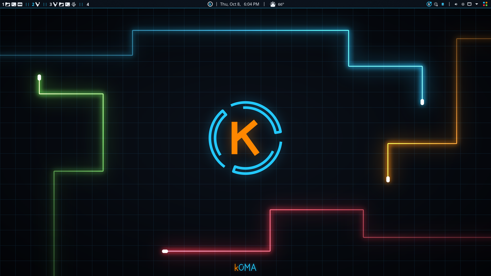
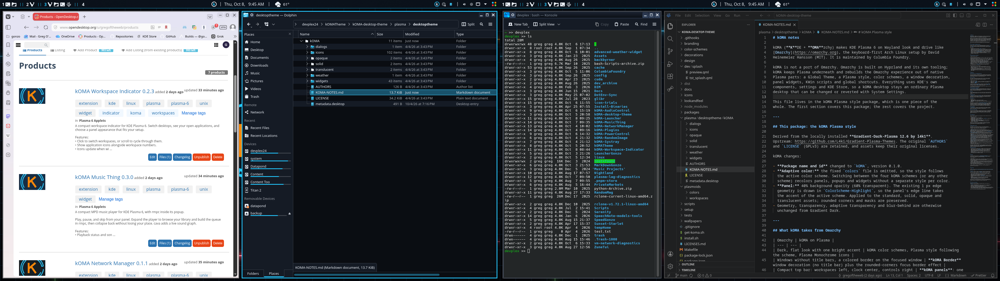

# kOMA Desktop Theme

Custom KDE Plasma 6 (Wayland) desktop inspired by Omarchy, maintained by Columbia Foundry.





## Install

Current version: **0.1.11**. In a KDE Plasma 6 session, open a terminal and run:

```sh
curl -fsSL https://github.com/gregoftheweb/kOMA-desktop-theme/releases/download/v0.1.11/get-koma.sh | bash
```

This downloads the kOMA installer, checks it against the release checksums, and opens
it. The installer shows every change and asks before applying anything; your current
settings are backed up first and can be restored from the installer at any time.
Afterwards it is also available from the kOMA Launcher under **Setup › kOMA Installer**.

Prefer to read it first? Download `get-koma.sh` from the
[0.1.11 release](https://github.com/gregoftheweb/kOMA-desktop-theme/releases/tag/v0.1.11)
and run `bash get-koma.sh`. Details of every choice: [installer guide](docs/installer.md).

Requirements: KDE Plasma 6, Python 3, curl. On Arch-based systems the installer can
install the remaining packages it needs, asking for your password.

## Development

`make setup` once, then `make check` (also the pre-commit hook). `make pins` updates
the bundled kOMA widgets to their latest releases, `make packages` rebuilds the Global
Theme and Colors packages, and `make release` builds `dist/` from the committed tree.
The local preparation plan lives outside this repository at
`../Docs/theme-preparation-plan.md` in the kOMATheme workspace.

Source: https://github.com/gregoftheweb/kOMA-desktop-theme

- `scripts/`     – helper scripts (e.g. `clone-panel.sh`: rebuild every panel as a copy of the template panel)
- `plasmoids/`   – internal Colors widget and legacy workspace source
- `lookandfeel/` – Global Theme package, panel defaults, and splash
- `setup/`       – appearance installation, shortcuts, and login background
- Planning documents and raw assets live in the parent workspace, outside Git.

Appearance package details: [the appearance guide](lookandfeel/README.md).

## Component licenses and attribution

This repository contains components with different licenses; it has no single
license that replaces those component licenses. See [LICENSES.md](LICENSES.md).
Original notices are retained. The wallpaper/artwork redistribution audit remains
a release task, as described in the preparation plan.

Workflow for panels: edit only the template panel (id 28, right screen), then run
`scripts/clone-panel.sh` to copy it onto every other panel.
